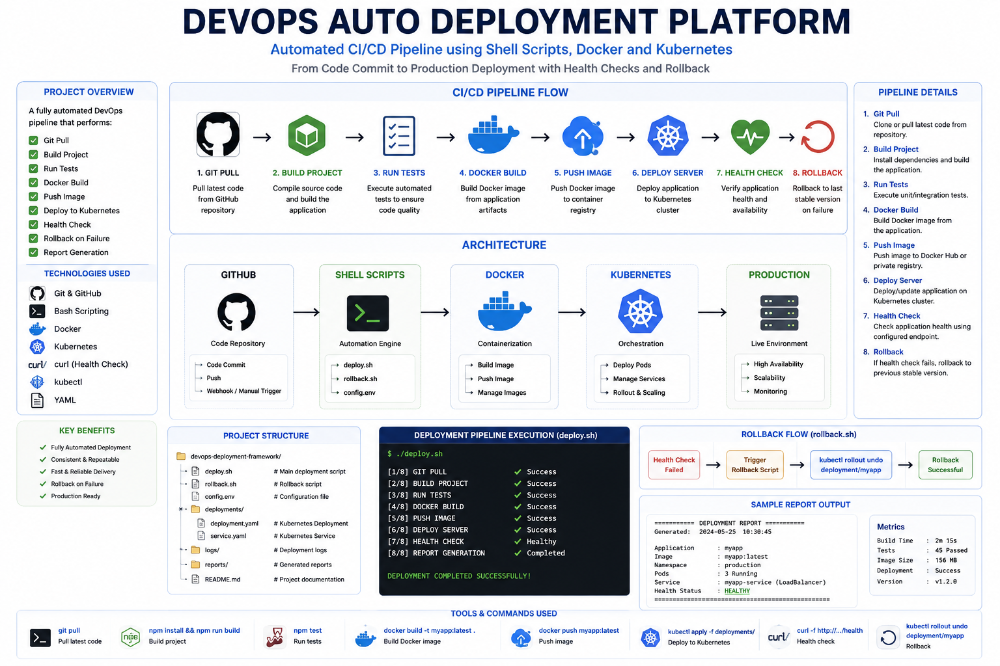

# DevOps Deployment Framework

Automated CI/CD deployment framework built using Shell Scripting, Docker, Kubernetes, and Git.

This project demonstrates a complete deployment lifecycle from source code retrieval to production deployment with automated health checks and rollback capabilities.

---

## Architecture Overview

<p align="center">
    
</p>

The framework automates the following deployment workflow:

```text
Developer
    │
    ▼
GitHub Repository
    │
    ▼
Deployment Framework
    │
    ├── Git Pull
    ├── Build Project
    ├── Run Tests
    ├── Docker Build
    ├── Docker Push
    ├── Kubernetes Deploy
    ├── Health Check
    └── Rollback Engine
    │
    ▼
Production Environment
```

---

# Features

| Feature               | Description                           |
| --------------------- | ------------------------------------- |
| Git Integration       | Pull latest code from repository      |
| Automated Build       | Build application automatically       |
| Test Execution        | Run automated tests before deployment |
| Docker Integration    | Build and push Docker images          |
| Kubernetes Deployment | Deploy to Kubernetes cluster          |
| Health Monitoring     | Validate deployment health            |
| Rollback System       | Automatic rollback on failure         |
| Report Generation     | Create deployment reports             |
| Logging               | Store deployment execution logs       |
| Namespace Support     | Deploy into specific environments     |

---

# Project Structure

```text
devops-deployment-framework/
│
├── deploy.sh
├── rollback.sh
├── config.env
│
├── deployments/
│   ├── deployment.yaml
│   └── service.yaml
│
├── logs/
│
├── reports/
│
├── images/
│   └── devops-architecture.png
│
└── README.md
```

---

# Deployment Pipeline

<p align="center">
    
</p>

## Pipeline Stages

| Stage | Action               |
| ----- | -------------------- |
| 1     | Git Pull             |
| 2     | Build Project        |
| 3     | Run Tests            |
| 4     | Docker Build         |
| 5     | Docker Push          |
| 6     | Deploy Kubernetes    |
| 7     | Health Check         |
| 8     | Production Release   |
| 9     | Rollback (if failed) |

---

# Workflow Diagram

```text
GitHub
   │
   ▼
Shell Scripts
   │
   ▼
Docker Build
   │
   ▼
Docker Registry
   │
   ▼
Kubernetes Cluster
   │
   ▼
Production Environment
```

---

# Core Components

## Deployment Engine

Responsible for:

* Source code retrieval
* Application build
* Test execution
* Deployment orchestration

---

## Docker Engine

Responsible for:

* Container image creation
* Image tagging
* Registry publishing

---

## Kubernetes Engine

Responsible for:

* Deployment updates
* Replica management
* Rollout monitoring
* Service exposure

---

## Monitoring Engine

Responsible for:

* Application health verification
* Endpoint validation
* Availability checks

---

## Rollback Engine

Responsible for:

* Deployment recovery
* Previous version restoration
* Rollout rollback

---

# Configuration

Example configuration file:

```bash
GIT_REPO=https://github.com/company/project.git

PROJECT_NAME=myapp

DOCKER_IMAGE=myapp

DOCKER_TAG=latest

DOCKER_REGISTRY=docker.io

KUBE_NAMESPACE=production

KUBE_DEPLOYMENT=myapp-deployment

KUBE_CONTAINER=myapp

HEALTH_URL=http://localhost:3000/health
```

---

# Deployment Process

## Pull Source Code

```bash
git pull origin main
```

---

## Build Application

```bash
npm install
npm run build
```

---

## Execute Tests

```bash
npm test
```

---

## Build Docker Image

```bash
docker build -t myapp:latest .
```

---

## Push Docker Image

```bash
docker push myapp:latest
```

---

## Deploy Kubernetes Resources

```bash
kubectl apply -f deployment.yaml
kubectl apply -f service.yaml
```

---

## Monitor Rollout

```bash
kubectl rollout status deployment/myapp
```

---

## Verify Health

```bash
curl http://localhost:3000/health
```

---

## Rollback if Needed

```bash
kubectl rollout undo deployment/myapp
```

---

# Generated Reports

Example deployment report:

```text
DEPLOYMENT REPORT

Git Repository
Docker Image
Kubernetes Namespace
Pods Status
Services Status
Health Check Results
Deployment Timestamp
```

---

# Sample Output

```text
====================================================
DEPLOYMENT STARTED
====================================================

Git Pull Completed

Build Completed

Tests Passed

Docker Image Built

Image Pushed

Kubernetes Deployment Updated

Rollout Successful

Health Check Passed

Deployment Completed Successfully
```

---

# Technologies Used

| Category         | Technology         |
| ---------------- | ------------------ |
| Version Control  | Git                |
| CI/CD            | Shell Script       |
| Containerization | Docker             |
| Orchestration    | Kubernetes         |
| Monitoring       | Curl               |
| Automation       | Bash               |
| Logging          | Linux Logging      |
| Infrastructure   | Kubernetes Cluster |

---

# Requirements

| Software   | Version                  |
| ---------- | ------------------------ |
| Linux      | Ubuntu / Debian / CentOS |
| Git        | Latest                   |
| Docker     | Latest                   |
| Kubernetes | Latest                   |
| Kubectl    | Latest                   |
| Bash       | 5+                       |

---

# Running the Project

```bash
chmod +x deploy.sh
chmod +x rollback.sh

./deploy.sh
```

---

# Future Enhancements

* GitHub Actions Integration
* Jenkins Pipeline Support
* Multi-Cluster Deployment
* Blue-Green Deployment
* Canary Deployment
* Slack Notifications
* Email Alerts
* Prometheus Monitoring
* Grafana Dashboards
* Automated Security Scanning

---

# License

MIT License

Copyright (c) 2026

DevOps Deployment Framework
